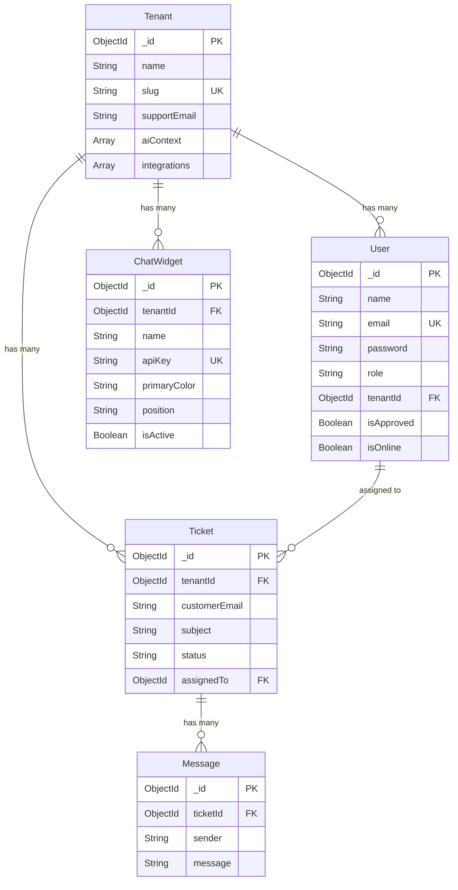
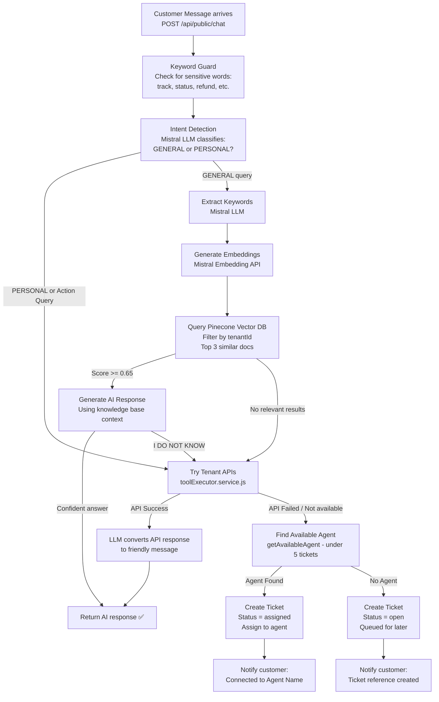
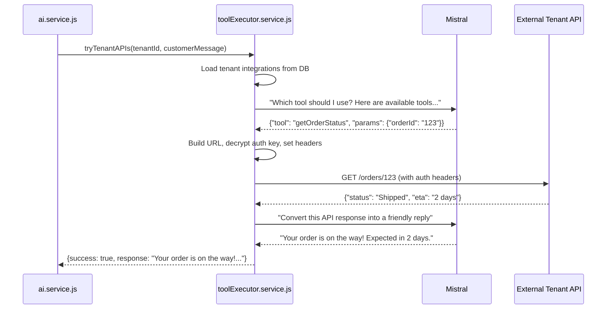
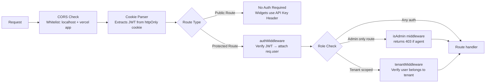

# ⚙️ SupportDesk — Backend

The SupportDesk backend is a **Node.js + Express** REST API server. It handles multi-tenant authentication, ticket management, AI processing via Mistral LLM, vector database search through Pinecone, and tenant-configurable API integrations.

---

## 📦 Tech Stack

| Tool                     | Purpose                                            |
| ------------------------ | -------------------------------------------------- |
| **Node.js + Express 5**  | HTTP server & routing                              |
| **MongoDB + Mongoose 9** | Primary database                                   |
| **Pinecone**             | Vector database for AI knowledge base              |
| **Mistral AI**           | LLM for query classification & response generation |
| **LangChain**            | LLM orchestration + text splitting                 |
| **JWT + bcryptjs**       | Authentication & password hashing                  |
| **Multer + ImageKit**    | File upload handling                               |
| **pdf-parse**            | Extract text from PDF uploads                      |
| **Axios**                | Call tenant-configured external APIs               |
| **Morgan**               | HTTP request logging                               |

---

## 📁 Project Structure

```
Backend/
├── server.js               ← Entry point (starts HTTP server)
├── src/
│   ├── app.js              ← Express app setup, middleware, route mounting
│   ├── config/
│   │   ├── config.js       ← Environment variable loader
│   │   ├── db.js           ← MongoDB connection
│   │   ├── vectorDb.js     ← Pinecone client setup
│   │   └── multer.js       ← File upload config
│   ├── models/
│   │   ├── tenant.model.js     ← Tenant (company) schema
│   │   ├── user.model.js       ← Admin/Agent user schema
│   │   ├── ticket.model.js     ← Support ticket schema
│   │   ├── message.model.js    ← Chat message schema
│   │   ├── chatWidget.model.js ← Widget configuration schema
│   │   └── apiKey.model.js     ← Widget API key schema
│   ├── routes/
│   │   ├── auth.routes.js      ← /api/auth/*
│   │   ├── admin.routes.js     ← /api/admin/*
│   │   ├── ticket.routes.js    ← /api/tickets/*
│   │   ├── message.routes.js   ← /api/messages/*
│   │   ├── chatWidget.routes.js← /api/admin/widgets/*
│   │   └── public.routes.js    ← /api/public/* (widget chat, no auth)
│   ├── controllers/
│   │   ├── auth.controller.js
│   │   ├── admin.controller.js
│   │   ├── ticket.controller.js
│   │   ├── message.controller.js
│   │   ├── chatWidget.controller.js
│   │   └── widgetConfig.controller.js
│   ├── service/
│   │   ├── ai.service.js           ← Core AI logic (Mistral + Pinecone)
│   │   ├── toolExecutor.service.js ← Tenant API integration executor
│   │   ├── auth.service.js
│   │   ├── admin.service.js
│   │   ├── message.service.js
│   │   ├── ticket.service.js
│   │   └── storage.service.js
│   ├── dao/
│   │   ├── message.dao.js      ← Message + agent availability queries
│   │   └── ticket.dao.js       ← Ticket CRUD queries
│   ├── middleware/
│   │   ├── auth.middleware.js  ← JWT verify, isAdmin, tenantMiddleware
│   │   └── roleCheck.middleware.js
│   ├── utils/
│   │   ├── appError.js         ← Custom error class
│   │   ├── getEmbeddings.js    ← Mistral embedding generator
│   │   └── encryption.js       ← AES encrypt/decrypt for API keys
│   └── validation/             ← express-validator schemas
```

---

## 🗄️ Database Schema



---

## 🔑 API Reference

### Auth Routes (`/api/auth`)

| Method | Route              | Access  | Description                             |
| ------ | ------------------ | ------- | --------------------------------------- |
| POST   | `/tenant/register` | Public  | Register a new company + admin          |
| POST   | `/register`        | Public  | Register an agent under existing tenant |
| POST   | `/login`           | Public  | Login and get JWT cookie                |
| POST   | `/logout`          | Private | Clear auth cookie                       |
| GET    | `/me`              | Private | Get current user info                   |
| GET    | `/tenant?slug=...` | Public  | Get tenant by slug                      |
| PATCH  | `/update-password` | Private | Change password                         |

### Admin Routes (`/api/admin`)

| Method | Route                | Access      | Description                      |
| ------ | -------------------- | ----------- | -------------------------------- |
| GET    | `/users`             | Admin       | List all agents/users in tenant  |
| PATCH  | `/users/:id/approve` | Admin       | Approve an agent                 |
| PATCH  | `/users/:id/role`    | Admin       | Update agent role                |
| GET    | `/stats`             | Admin/Agent | Get dashboard stats              |
| POST   | `/tenant/context`    | Admin       | Upload PDF for AI knowledge base |
| PUT    | `/integrations`      | Admin       | Update tenant API integrations   |

### Ticket Routes (`/api/tickets`)

| Method | Route         | Access | Description                              |
| ------ | ------------- | ------ | ---------------------------------------- |
| GET    | `/`           | Auth   | List tickets (with filters & pagination) |
| GET    | `/:id`        | Auth   | Get single ticket                        |
| PATCH  | `/:id/status` | Auth   | Update ticket status                     |
| PATCH  | `/:id/assign` | Admin  | Manually assign ticket to agent          |

### Message Routes (`/api/messages`)

| Method | Route                          | Access | Description                   |
| ------ | ------------------------------ | ------ | ----------------------------- |
| GET    | `/ticket/:ticketId`            | Auth   | Get all messages for a ticket |
| POST   | `/ticket/:ticketId`            | Auth   | Send a message as agent       |
| POST   | `/ticket/:ticketId/ai-suggest` | Auth   | Get AI reply suggestion       |

### Widget Routes (`/api/admin/widgets`)

| Method | Route                 | Access | Description        |
| ------ | --------------------- | ------ | ------------------ |
| GET    | `/`                   | Admin  | List all widgets   |
| POST   | `/`                   | Admin  | Create widget      |
| GET    | `/:id`                | Admin  | Get single widget  |
| PUT    | `/:id`                | Admin  | Update widget      |
| DELETE | `/:id`                | Admin  | Delete widget      |
| POST   | `/:id/regenerate-key` | Admin  | Regenerate API key |

### Public Routes (`/api/public`)

| Method | Route            | Access  | Description                                        |
| ------ | ---------------- | ------- | -------------------------------------------------- |
| POST   | `/chat`          | API Key | Customer sends first message, triggers AI pipeline |
| POST   | `/chat/followup` | API Key | Customer sends follow-up on existing ticket        |
| GET    | `/chat/history`  | API Key | Get chat history for a ticket                      |

---

## 🧠 AI Processing Pipeline

This is the most complex part of the system. When a customer sends a message, the following pipeline runs:



---

## 🔌 Tenant API Integration (Tool Executor)

Admins can configure external REST APIs. When a customer query matches, the AI calls the right API automatically:



---

## 🔐 Security Architecture



**Key security features:**

- JWT stored in `httpOnly` cookies (not accessible to JavaScript)
- Passwords hashed with bcrypt (10 rounds)
- Tenant integration API keys encrypted with AES before storage
- All admin routes doubly protected (auth + role check)
- Widget API keys are scoped per widget and tenant

---

## ⚙️ Environment Variables

Create a `.env` file in `Backend/`:

```env
PORT=3000
MONGO_URI=mongodb+srv://...
JWT_SECRET=your_jwt_secret
MISTRAL_KEY=your_mistral_api_key
PINECONE_API_KEY=your_pinecone_key
PINECONE_INDEX=your_index_name
IMAGEKIT_PUBLIC_KEY=...
IMAGEKIT_PRIVATE_KEY=...
IMAGEKIT_URL_ENDPOINT=...
ENCRYPTION_KEY=32_byte_hex_key
```

---

## 🚀 Running Locally

```bash
# Install dependencies
npm install

# Start dev server with nodemon
npm run dev
```

> Server starts on `http://localhost:3000`
