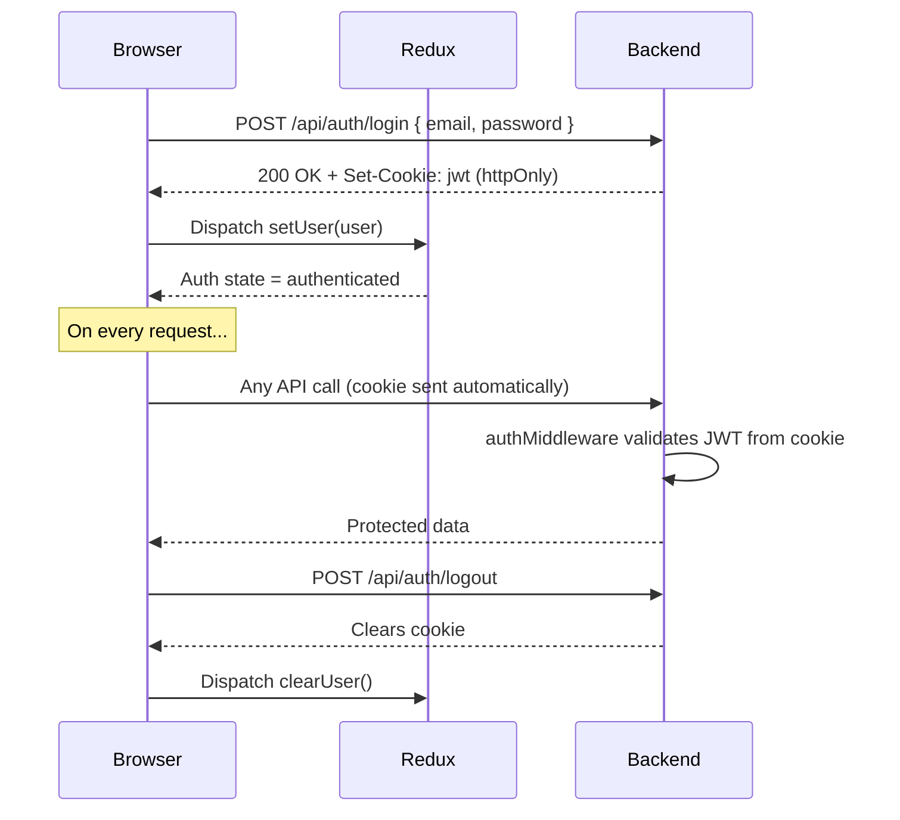
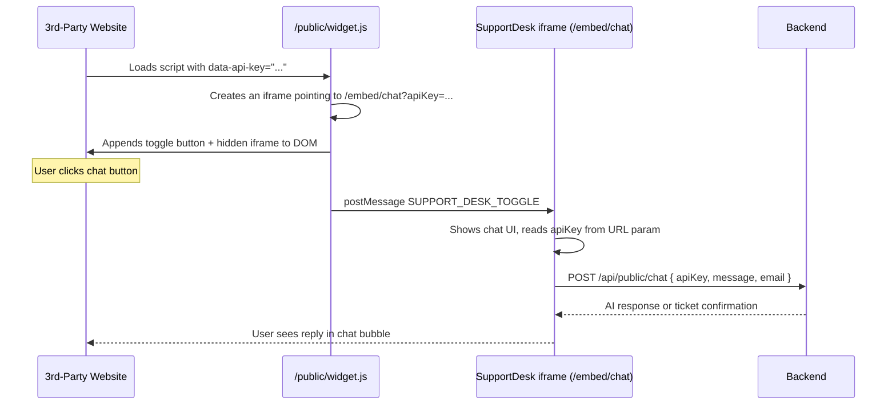
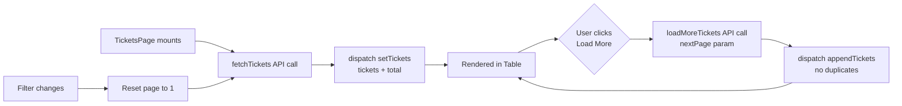

# 🖥️ SupportDesk — Frontend

> **Live App:** [https://support-desk-one-lilac.vercel.app/](https://support-desk-one-lilac.vercel.app/)

The SupportDesk frontend is a React + Vite single-page application (SPA). It serves as the admin/agent dashboard, the embeddable chat widget, and the public landing/docs pages — all in one deployable bundle.

---

## 📦 Tech Stack

| Tool | Purpose |
|---|---|
| **React 19** | UI rendering |
| **Vite 8** | Dev server & build |
| **React Router 7** | Client-side routing |
| **Redux Toolkit** | Global state management |
| **Axios** | HTTP requests to the backend |
| **Tailwind CSS 4** | Utility-first styling |
| **Lucide React** | Icon library |
| **React Hot Toast** | Notifications |
| **React Markdown** | Render markdown in chat |

---

## 📁 Project Structure

```
Frontend/
├── public/
│   ├── widget.js          ← Embeddable widget loader script
│   └── favicon.svg        ← App favicon
├── src/
│   ├── app/
│   │   └── routes/
│   │       ├── AppRoutes.jsx       ← Root router
│   │       ├── TenantLoader.jsx    ← Resolves /:slug to tenant
│   │       ├── ProtectedRoute.jsx  ← Auth guard
│   │       └── AdminGuard.jsx      ← Admin-only route guard
│   ├── features/
│   │   ├── auth/           ← Login / Register pages
│   │   ├── dashboard/      ← Dashboard with stats & recent tickets
│   │   ├── tickets/        ← Ticket list + detail pages
│   │   ├── agents/         ← Agent management (admin only)
│   │   ├── widgets/        ← Widget management + embedded chat
│   │   ├── ai-context/     ← Upload docs for AI knowledge base
│   │   ├── settings/       ← User profile settings
│   │   ├── landing/        ← Public marketing landing page
│   │   └── docs/           ← Public API documentation page
│   ├── shared/
│   │   └── components/
│   │       ├── layout/     ← DashboardLayout, Sidebar, Navbar
│   │       ├── ui/         ← Badge, Table, Spinner, etc.
│   │       └── pages/      ← NotFoundPage
│   ├── lib/
│   │   └── axios.js        ← Configured Axios instance w/ interceptors
│   └── index.css           ← Global styles
├── index.html              ← Entry HTML with SEO meta tags
└── vite.config.js
```

---

## 🗺️ Routing Architecture

```mermaid
flowchart TD
    A[User visits URL] --> B{Path?}

    B --> |/| C[LandingPage]
    B --> |/docs| D[DocsPage]
    B --> |/auth| E[AuthPage]
    B --> |/embed/chat| F[ChatWidgetPage\nEmbedded iframe view]

    B --> |/:tenantSlug/*| G[TenantLoader\nResolve slug → tenantId]

    G --> |Slug not found| H[404 NotFoundPage]
    G --> |Slug OK| I{ProtectedRoute\nIs user logged in?}

    I --> |No cookie / not authed| J[Redirect to /auth]
    I --> |Authenticated| K[Tenant Dashboard Routes]

    K --> L[/dashboard]
    K --> M[/tickets]
    K --> N[/tickets/:id]
    K --> O[/settings]

    K --> P{AdminGuard\nRole === admin?}
    P --> |No - agent role| Q[403 Forbidden]
    P --> |Yes| R[/agents]
    P --> |Yes| S[/widgets]
    P --> |Yes| T[/ai-context]
```

---

## 🔄 Authentication Flow



---

## 🧩 Embeddable Widget Flow

The widget is designed to be embedded on **any external website** via a single `<script>` tag.



**Embedding snippet:**
```html
<script
  src="https://support-desk-one-lilac.vercel.app/widget.js"
  data-api-key="YOUR_WIDGET_API_KEY"
  id="support-desk-widget"
></script>
```

---

## 🗃️ State Management (Redux)

The app uses **Redux Toolkit** slices for global state:

| Slice | State Managed |
|---|---|
| `authSlice` | `user`, `tenant`, auth loading |
| `ticketSlice` | `tickets[]`, `total`, `activeFilter`, `activeTicket`, messages |

### Ticket State Flow



---

## 🖼️ Key Pages & Features

### Dashboard
- Stat cards: Total, Open, Assigned, Resolved ticket counts
- Recent tickets table with **Load More** pagination

### Tickets Page
- Filter by: `all`, `open`, `assigned`, `resolved`
- Search by customer email or subject
- **Load More** button appends next page to the list

### Ticket Detail Page
- Full message thread (customer ↔ AI ↔ Agent)
- Send message as agent
- AI reply suggestion button
- Status change (Open → Assigned → Resolved)
- Manual agent reassignment (admin only)

### Widgets Page *(Admin Only)*
- Create/Edit/Delete chat widgets
- Configure colors, position, title, welcome message
- Regenerate API keys
- Copy embed code snippet

### AI Context Page *(Admin Only)*
- Upload PDFs/docs to feed the AI knowledge base
- Data is scraped, embedded, and stored in Pinecone vector DB

### Agents Page *(Admin Only)*
- View all agents under the tenant
- Approve pending agent registrations
- Update agent roles

---

## ⚙️ Environment Variables

Create a `.env` file in the `Frontend/` directory:

```env
VITE_API_URL=https://your-backend-url.com
```

---

## 🚀 Running Locally

```bash
# Install dependencies
npm install

# Start dev server (http://localhost:5173)
npm run dev

# Build for production
npm run build
```
