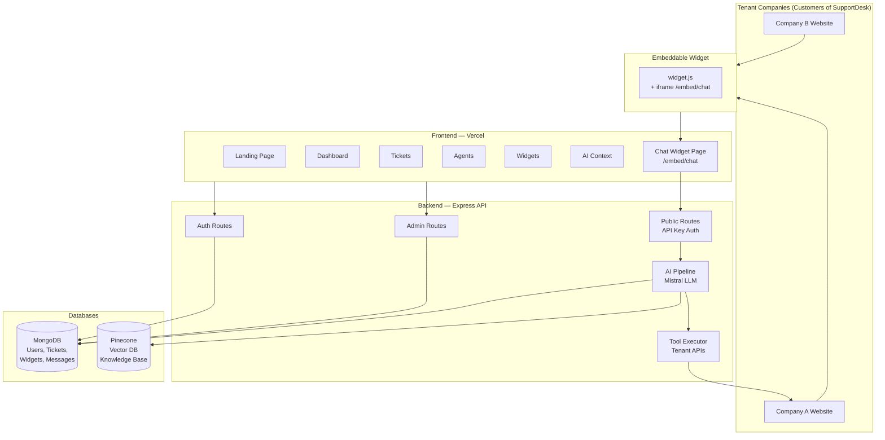
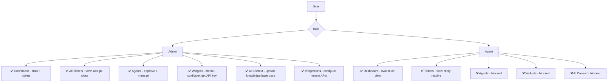
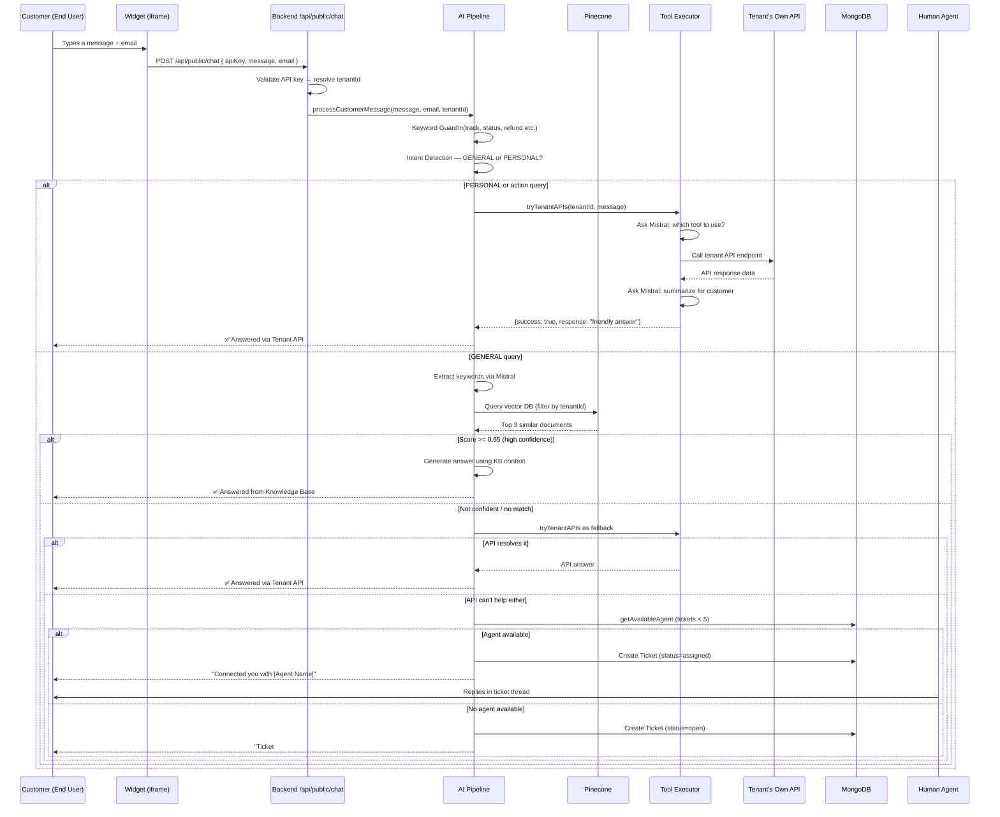
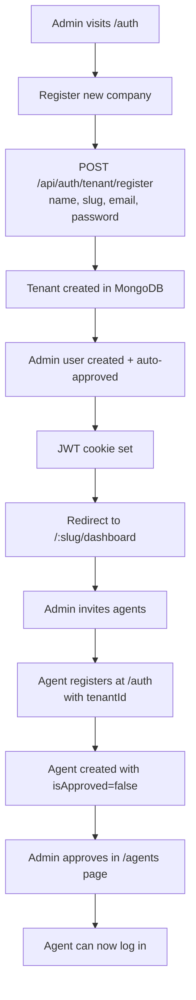
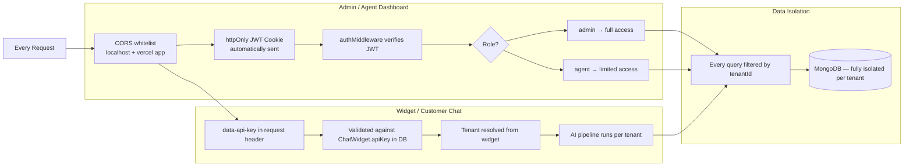

# ⚡ SupportDesk — AI Customer Support Platform

> **🌐 Live App:** [https://support-desk-one-lilac.vercel.app/](https://support-desk-one-lilac.vercel.app/)

SupportDesk is a **multi-tenant, AI-powered customer support platform**. Companies (tenants) onboard onto the platform, create embeddable chat widgets for their websites, and let the AI automatically resolve customer queries using their knowledge base — only routing to human agents when necessary.

---

## ✨ What It Does

| Feature | Description |
|---|---|
| 🤖 **AI-First Support** | Mistral LLM + Pinecone vector search resolves queries automatically |
| 🎫 **Smart Ticketing** | Tickets created automatically, assigned to agents by load (< 5 tickets) |
| 🔌 **Embeddable Widget** | One `<script>` tag adds chat to any website |
| 🏢 **Multi-Tenant** | Fully isolated data — each company has its own workspace |
| 🔗 **API Integrations** | AI can call tenant's own APIs (e.g. order tracking) before escalating |
| 👥 **Agent Management** | Admins approve agents, manage roles, reassign tickets |
| 📚 **Knowledge Base** | Upload PDFs — the AI learns from them per tenant |

---

## 🏛️ High-Level Architecture



---

## 👤 User Roles & Permissions



---

## 🔄 Complete Customer Support Journey

This is the end-to-end flow from a customer typing a message to getting a resolution:



---

## 🧰 Tenant Onboarding Flow



---

## 📡 Monorepo Structure

```
Support_Desk/
├── Backend/            ← Node.js + Express REST API
│   ├── src/
│   │   ├── models/     ← MongoDB Mongoose schemas
│   │   ├── controllers/← Request handlers
│   │   ├── service/    ← Business logic (AI, auth, admin...)
│   │   ├── routes/     ← API route definitions
│   │   ├── middleware/  ← Auth, role checks
│   │   ├── dao/        ← DB query helpers
│   │   └── utils/      ← Helpers (encryption, embeddings, errors)
│   └── README.md       ← Backend documentation ← You are here
│
└── Frontend/           ← React + Vite SPA
    ├── public/
    │   └── widget.js   ← Embeddable script for 3rd-party sites
    ├── src/
    │   ├── app/        ← Root router + route guards
    │   ├── features/   ← Page-level feature modules
    │   ├── shared/     ← Reusable components + layout
    │   └── lib/        ← Axios instance
    └── README.md       ← Frontend documentation
```

---

## 🔐 Security Model



---

## 🌐 Deployment

| Layer | Platform | Details |
|---|---|---|
| **Frontend** | Vercel | Auto-deploys on push. `vercel.json` rewrites all routes to `index.html` for SPA |
| **Backend** | Any Node host (Railway / Render / VPS) | `npm run dev` via nodemon in development |
| **Database** | MongoDB Atlas | Cloud-hosted, connection via `MONGO_URI` env var |
| **Vector DB** | Pinecone | Serverless index, filtered by `tenantId` metadata |
| **LLM** | Mistral AI API | `mistral-large-latest` model |

---

## 🚀 Getting Started

### Prerequisites
- Node.js 18+
- MongoDB Atlas account
- Pinecone account (free tier works)
- Mistral AI API key

### 1. Clone & Install

```bash
git clone <your-repo-url>

# Backend
cd Backend
npm install

# Frontend
cd ../Frontend
npm install
```

### 2. Configure Environment

**Backend `.env`:**
```env
PORT=5000
MONGO_URI=mongodb+srv://...
JWT_SECRET=your_secret
MISTRAL_KEY=sk-...
PINECONE_API_KEY=...
PINECONE_INDEX=support-desk
ENCRYPTION_KEY=32_hex_chars...
```

**Frontend `.env`:**
```env
VITE_API_URL=http://localhost:5000
```

### 3. Run

```bash
# Terminal 1 — Backend
cd Backend && npm run dev

# Terminal 2 — Frontend
cd Frontend && npm run dev
```

Open [http://localhost:5173](http://localhost:5173)

### 4. First-Time Setup

1. Go to `/auth` → **Register new company**
2. Fill in company name, slug (e.g. `acme`), support email, admin password
3. You'll land on `/{slug}/dashboard`
4. Go to **Widgets** → Create a widget → Copy the API key
5. Go to **AI Context** → Upload a PDF with your company's FAQ
6. Embed the widget script on any HTML page and test it!

---

## 📎 Quick Links

- 📖 [Frontend README](./Frontend/README.md)
- ⚙️ [Backend README](./Backend/README.md)
- 🌐 [Live App](https://support-desk-one-lilac.vercel.app/)
